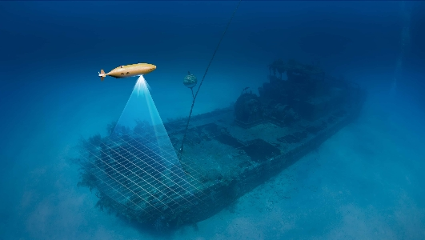
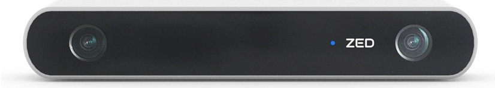
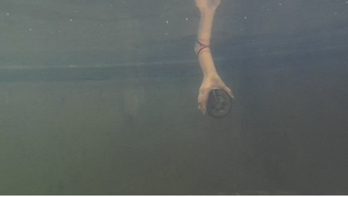
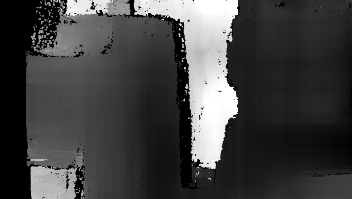
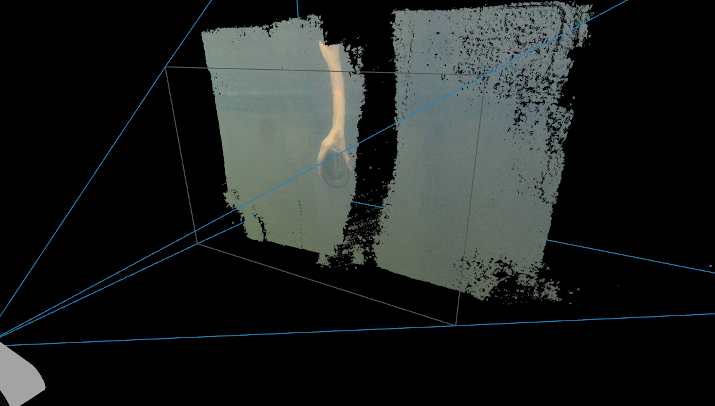

# Underwater 3D Vision

### Disadventages of Distance Sensors and Power of Stereo Cameras

There are variety of sensors types for measuring distances. It is possible to measure distances using infra-red light, radio waves, lasers etc. Radars and Lidars are widespread because of their performance and accuracy. However, most of these sensors do not work well under water. Radio waves for instance; will be reduced, thus they cannot travel long distances under water.

Other sensors such as IR light sensors also cannot operate properly due to the refraction caused by medium changes. I.e. the sensor transmits the light but the light does not come back to receiver. To get rid of this refraction we need to make the sensor waterproof. Yet refraction is not the only problem. According to this <b><a href="https://ieeexplore.ieee.org/document/7477644">article</a></b>, infra-red light is heavily attenuated in water, as a result their maximum range under water is 20-25cm. So from our point of view they are useless just like RF sensors.

<b>Well then, what is being used for underwater applications?</b> you might ask. Of course there are underwater sensors for measuring distances and Sonar is most likely to be used. Sonars use acoustic waves (considered sound waves in water). Sonar can see obstacles from hundreds of meters away, therefore that makes sonar like Elvis of underwater sensors. Although sonars are especially developed for underwater use and can obtain perfect accuracy, they are costly to use for our student project.

You can ask: <b>Is measuring distance really that hard? Even I can estimate distances with my eyes.</b> That's a great question. Most of the projects don't need to obtain millimeter level precision so they use cameras. Yes, with the help of computer vision algorithms we can predict distance fairly good. And yes, we decided to use a camera but we didn’t want to use just a regular camera, instead we decided to put a camera that sees like we do.

<figure>
    
    <!-- Source: https://cdn.stereolabs.com/img/product/ZED_product_main.jpg -->
    <figcaption>
        <i>We see the world with two eyes. Cameras see the world with only one lens.</i>
    </figcaption>
    </img>
</figure>

A company called Stereolabs developed a camera that can see the world in 3D. ZED Camera has two lenses and can capture depth for every single pixel in real time. ZED is not the only stereo camera of course, there are other cameras from different companies but the idea is the same. Our AUV can detect obstacles in water and plan its trajectory to avoid obstacles.

In addition to that, ZED has 6-Axis Positional Tracking, thanks to visual odometry technology. It tracks the environment and calculates camera position and orientation in 3D space with high accuracy. This is an essential service for our AUV. The odometry data coming from ZED can help our autonomous navigation system. Using that data, it is possible to generate the 3D model of objects under water and make survey mapping.

Here is our test results:

<table>
<tr>
<td>
<figure>
    
    <figcaption> Raw Image </figcaption>
</figure>
</td>
<td>
<figure>
    
    <figcaption> Depth Image </figcaption>
</figure>
</td>
<td>
<figure>
    
    <figcaption> Point Cloud </figcaption>
</figure>
</td>
</tr>
</table>